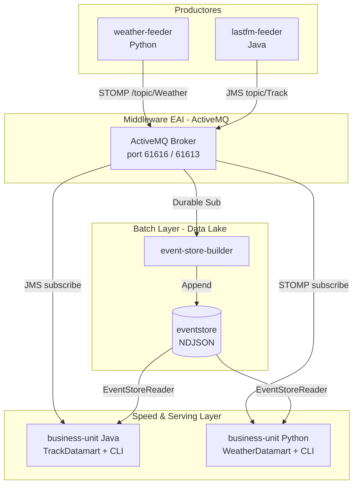
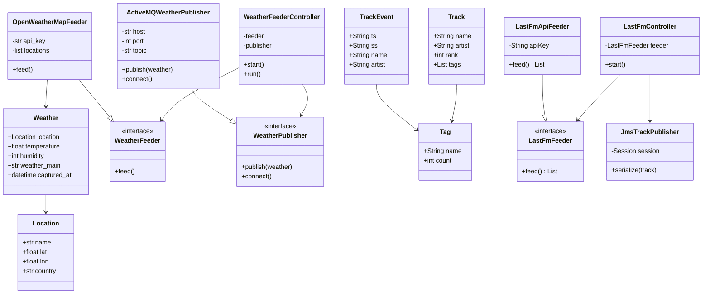
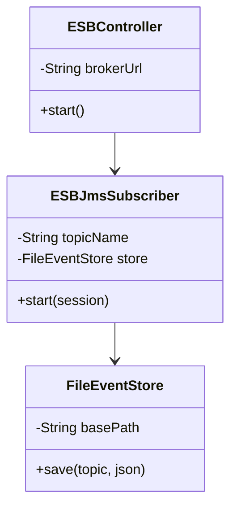
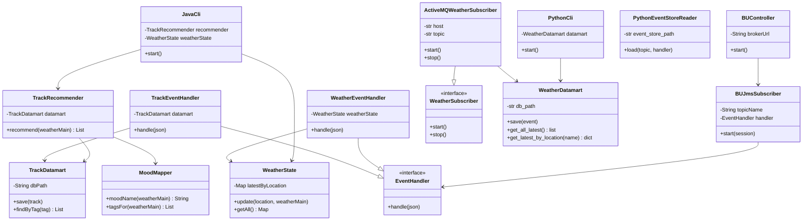

# Music Weather Recommender

Sistema que recomienda música en función del tiempo meteorológico actual. Combina datos de canciones populares de Last.fm con datos meteorológicos en tiempo real de OpenWeatherMap para sugerir listas de reproducción adaptadas al estado de ánimo que provoca el clima.

---

## Propuesta de valor

El usuario selecciona una condición meteorológica (o deja que el sistema detecte el tiempo real de su ciudad) y recibe al instante un ranking de canciones cuyo género y etiquetas encajan con el estado de ánimo asociado a ese clima. La correspondencia clima → ánimo → música se basa en el modelo circunflejo de Russell (cuadrantes Q1–Q4), ampliamente usado en investigación de Music Emotion Recognition.

| Clima | Ánimo (cuadrante) | Géneros típicos |
|---|---|---|
| Despejado (Clear) | Feliz — Q1 | Pop, dance, disco, funk |
| Nubes (Clouds) | Relajado — Q4 | Ambient, chillout, lo-fi, indie pop |
| Lluvia / Niebla / Nieve | Triste — Q3 | Indie folk, blues, acoustic, post-rock |
| Tormenta (Thunderstorm) | Enérgico/Agresivo — Q2 | Metal, punk, hardcore, rock |

---

## Arquitectura del sistema

El sistema sigue una arquitectura **Lambda/Kappa**: los datos fluyen desde los feeders hacia un event store persistente y simultáneamente a través de un broker de mensajería, permitiendo que la business-unit reconstruya su estado histórico al arrancar y reciba actualizaciones en tiempo real.



### Flujo de datos

1. **lastfm-feeder** consulta la API de Last.fm cada 6 horas y publica eventos `Track` (JSON) al topic `Track` de ActiveMQ.
2. **weather-feeder** consulta OpenWeatherMap cada hora y publica eventos `Weather` (JSON) al topic `Weather` vía STOMP.
3. **event-store-builder** está suscrito a ambos topics y persiste cada evento en ficheros NDJSON organizados por `topic/ss/fecha.events`.
4. **business-unit** al arrancar lee el event store completo para reconstruir el datamart SQLite y el estado de meteorología. Luego se suscribe en vivo a ambos topics para mantener los datos actualizados. El usuario interactúa a través de la CLI.

---

## Estructura del repositorio

```
music-weather-recommender/
├── lastfm-feeder/               # Sprint 1 — feeder de canciones (Java)
├── event-store-builder/         # Sprint 2 — almacén de eventos (Java + Python)
├── weather-feeder/              # Sprint 2 — feeder meteorológico (Python)
│   └── src/main/python/es/ulpgc/dacd/openweather/
├── business-unit/               # Sprint 3 — unidad de negocio y CLI
│   ├── src/                     # Java: recomendador musical
│   └── src/main/python/         # Python: datamart meteorológico
├── eventstore/                  # Datos generados: eventos en NDJSON
│   ├── Track/lastfm-feeder/
│   └── Weather/OpenWeatherMap/
├── pom.xml                      # POM raíz (multi-módulo Maven)
├── run.sh                       # Script de arranque completo
├── .env.example                 # Plantilla de configuración
└── README.md
```

---

## APIs utilizadas y justificación

### Last.fm API
- **Endpoint `geo.gettoptracks`**: top 300 canciones de España. Proporciona artistas y géneros con alta relevancia local.
- **Endpoint `chart.gettoptracks`**: top 300 canciones globales. Amplía el catálogo con tendencias internacionales.
- **Endpoint `track.gettoptags`**: etiquetas de género y estado de ánimo por canción, imprescindibles para la recomendación basada en mood.
- **Justificación**: Last.fm es la fuente de metadatos musicales etiquetados por comunidad más completa y accesible públicamente. Sus tags reflejan géneros y estados de ánimo con precisión validada por investigación académica (Çano & Morisio, 2017).

### OpenWeatherMap API
- **Endpoint `weather` (current)**: condición meteorológica actual por coordenadas geográficas.
- **Justificación**: API REST con tier gratuito generoso, cobertura global y campo `weather_main` con categorías discretas (Clear, Clouds, Rain, etc.) directamente mapeables a cuadrantes de ánimo.

---

## Estructura del datamart

El datamart es una base de datos SQLite con dos tablas:

```sql
CREATE TABLE tracks (
    id      INTEGER PRIMARY KEY AUTOINCREMENT,
    name    TEXT NOT NULL,
    artist  TEXT NOT NULL,
    mbid    TEXT,
    url     TEXT,
    rank    INTEGER,
    ts      TEXT NOT NULL,   -- ISO-8601 UTC
    ss      TEXT NOT NULL,   -- sistema fuente
    UNIQUE(name, artist)
);

CREATE TABLE track_tags (
    track_id  INTEGER NOT NULL REFERENCES tracks(id) ON DELETE CASCADE,
    tag_name  TEXT NOT NULL,
    tag_count INTEGER          -- peso de la etiqueta (0-100)
);
```

La unicidad `(name, artist)` garantiza que las actualizaciones de rank (al reejecutar el feeder) sobreescriban el registro anterior mediante `ON CONFLICT DO UPDATE`.

### Muestra del event store — Track

```json
{"ts":"2026-05-18T18:40:45.546421Z","ss":"lastfm-feeder","name":"Billie Jean","artist":"Michael Jackson","mbid":"005fd94f-...","rank":3,"tags":[{"name":"pop","count":100},{"name":"80s","count":83},{"name":"dance","count":35}]}
```

### Muestra del event store — Weather

```json
{"ts":"2026-05-18T23:04:05.455972+00:00","ss":"OpenWeatherMap","location":{"name":"Las Palmas de Gran Canaria","lat":28.1,"lon":-15.4,"country":"ES"},"temperature":18.96,"humidity":68,"weather_main":"Clouds","weather_description":"scattered clouds"}
```

### Muestra del datamart

| name | artist | rank |
|---|---|---|
| Stateside + Zara Larsson | PinkPantheress | 0 |
| drop dead | Olivia Rodrigo | 1 |
| Billie Jean | Michael Jackson | 3 |

El datamart contiene actualmente **460 canciones** con **3070 etiquetas** de género/mood.

---

## Requisitos previos

| Herramienta | Versión mínima |
|---|---|
| Java (JDK) | 21 |
| Maven | 3.8 |
| Python | 3.10 |
| Apache ActiveMQ Classic | 5.x |
| stomp.py (Python) | cualquiera |
| requests (Python) | cualquiera |

Instalar dependencias Python:

```bash
pip3 install stomp.py requests
```

---

## Configuración

Copiar la plantilla y rellenar las claves:

```bash
cp .env.example .env
```

```env
LASTFM_API_KEY=tu_clave_lastfm
LASTFM_COUNTRY=spain
BROKER_URL=tcp://localhost:61616
EVENTSTORE_PATH=./eventstore
DATAMART_PATH=./datamart.db
OPENWEATHER_API_KEY=tu_clave_openweathermap
WEATHER_DB_PATH=./weather.db
```

> El fichero `.env` nunca debe commitearse. Está incluido en `.gitignore`.

---

## Compilación

Desde la raíz del proyecto:

```bash
mvn package -DskipTests
```

Genera los JARs en `<módulo>/target/<módulo>-1.0-SNAPSHOT.jar`.

---

## Ejecución

### Opción A — Script automático (recomendado)

Arranca todos los módulos en el orden correcto:

```bash
./run.sh
```

El script compila, lanza `event-store-builder`, `lastfm-feeder` y `weather-feeder` en segundo plano, y finalmente abre la CLI interactiva de `business-unit`. Al cerrar la CLI (opción `0`), los procesos de fondo se detienen automáticamente.

### Opción B — Manual (módulo a módulo)

**1. Asegurarse de que ActiveMQ está en marcha** (puerto 61616 JMS, 61613 STOMP).

**2. event-store-builder**
```bash
java -jar event-store-builder/target/event-store-builder-1.0-SNAPSHOT.jar \
  tcp://localhost:61616 ./eventstore
```

**3. lastfm-feeder**
```bash
java -jar lastfm-feeder/target/lastfm-feeder-1.0-SNAPSHOT.jar \
  <LASTFM_API_KEY> spain tcp://localhost:61616
```

**4. weather-feeder**
```bash
cd weather-feeder
PYTHONPATH=. python3 src/main.py <OPENWEATHER_API_KEY> ../weather.db 1
```
El tercer argumento es el intervalo en horas (por defecto 1).

**5. business-unit**
```bash
java -jar business-unit/target/business-unit-1.0-SNAPSHOT.jar \
  tcp://localhost:61616 ./eventstore ./datamart.db
```

---

## Ejemplo de uso — CLI

```
╔══════════════════════════════════════╗
║     Music Weather Recommender        ║
╚══════════════════════════════════════╝

Select a weather condition:
  1. Clear         →  Happy (Q1)
  2. Clouds        →  Relaxed (Q4)
  3. Rain          →  Sad (Q3)
  4. Drizzle       →  Sad (Q3)
  5. Snow          →  Sad (Q3)
  6. Thunderstorm  →  Angry (Q2)
  7. Fog           →  Sad (Q3)
  8. Mist          →  Sad (Q3)

  Live weather:
  9. Las Palmas de Gran Canaria        →  Clouds
  10. Santa Cruz de Tenerife           →  Clear
  11. Arrecife                         →  Clouds
  0. Exit

Option: 1

Weather: Clear  →  Mood: Happy (Q1)
──────────────────────────────────────────────────
   1. Billie Jean — Michael Jackson
   2. drop dead — Olivia Rodrigo
   3. Flowers — Miley Cyrus
   ...

  Showing 10 track(s).
```

---

## Principios y patrones de diseño

### Principios SOLID

- **SRP (Single Responsibility)**: cada clase tiene una única responsabilidad. `TrackDatamart` solo gestiona persistencia; `TrackRecommender` solo ejecuta la lógica de recomendación; `Cli` solo gestiona la interacción con el usuario.
- **OCP (Open/Closed)**: la interfaz `EventHandler` permite añadir nuevos tipos de eventos sin modificar `EventStoreReader` ni el `Controller`.
- **DIP (Dependency Inversion)**: `Controller` depende de las abstracciones `LastFmFeeder` y `TrackSerializer`, no de sus implementaciones concretas.

### Patrones de diseño

- **Strategy**: `TrackSerializer` es la estrategia; `JmsTrackPublisher` y `DatabaseTrackSerializer` son implementaciones intercambiables.
- **Observer**: el `MessageListener` de JMS implementa el patrón observador — el broker notifica a los suscriptores cuando llega un evento.
- **Repository**: `TrackDatamart` encapsula todo el acceso a SQLite y expone métodos de dominio (`save`, `findByTag`).
- **Template Method** (implícito): `LastFmFeeder` define el contrato `feed()` que `LastFmApiFeeder` implementa.

### Clean Code

- Nombres expresivos y sin abreviaciones.
- Logging mediante `java.util.logging.Logger` (nivel `SEVERE` para errores de infraestructura).
- Sin comentarios redundantes; el código se autodocumenta.
- Métodos cortos con una sola responsabilidad.

---

## Diagrama de clases

El diagrama se divide en tres bloques siguiendo la separación lógica de la arquitectura Lambda implementada: los **productores** generan y publican eventos, el **event store builder** los persiste de forma inmutable conformando el Data Lake, y la **business unit** los consume y transforma en información útil para el usuario.

### Productores de datos
Muestra los dos módulos encargados de la extracción y publicación hacia el broker. El `weather-feeder` (Python) consulta la API de OpenWeatherMap, mientras que el `lastfm-feeder` (Java) obtiene canciones de Last.fm. Ambos siguen el patrón feeder → publisher → controller.



### Event Store Builder
Módulo responsable de la persistencia inmutable del sistema. Suscribe todos los topics de ActiveMQ y escribe cada evento en ficheros `.events` organizados por topic, fuente y fecha.



### Business Unit
Capa de consumo y presentación. Persiste los eventos en dos datamarts especializados — uno en Java para recomendaciones musicales y otro en Python para datos meteorológicos — y expone una CLI para el usuario final.



---

## Localización de las ciudades monitorizadas

El `weather-feeder` consulta el tiempo actual de 8 ciudades de las Islas Canarias definidas en `weather-feeder/locations.json`:

- Las Palmas de Gran Canaria, Telde, Santa Cruz de Tenerife, Arrecife, Puerto del Rosario, Valverde, San Sebastián de La Gomera, Santa Cruz de La Palma.
